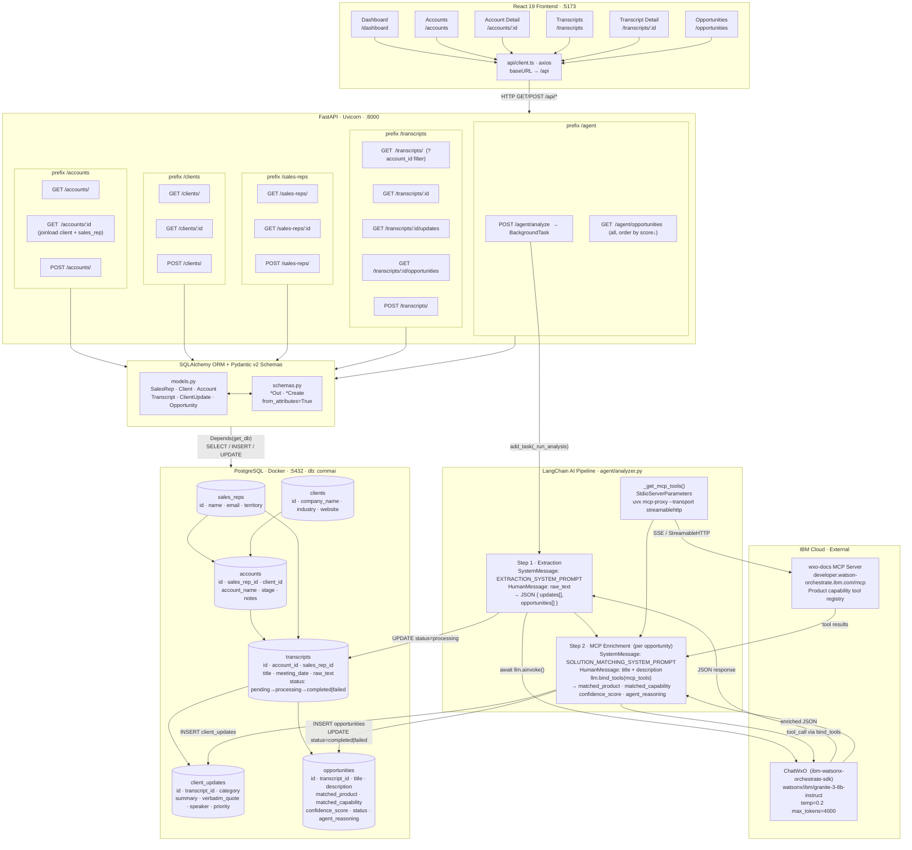

# CommAi — Sales Intelligence Platform (MVP)

A tool that analyzes meeting audio transcripts, extracts client updates and requirements, and matches them to watsonx Orchestrate product capabilities using an AI agent.

## Architecture

```
CommAi/
├── frontend/          # React + Carbon UI (Vite + TypeScript)
├── backend/           # FastAPI (Python) — REST API + LangChain AI agent
├── docker-compose.yml # Local PostgreSQL database
├── .env               # Environment variables (copy from .env.example)
└── .env.example       # Template
```

## Data Flow



## Quick Start

### 1. Prerequisites

- Docker Desktop (for PostgreSQL)
- Node.js 18+
- Python 3.11+
- `uvx` (install via `pip install uv`)

### 2. Environment variables

```bash
cp .env.example .env
# Edit .env and fill in:
#   WXO_INSTANCE_URL — your watsonx Orchestrate instance URL
#   WXO_API_KEY      — your watsonx Orchestrate API key
```

### 3. Start the database

```bash
docker-compose up -d
```

### 4. Backend setup

```bash
cd backend
python -m venv .venv
source .venv/bin/activate       # Windows: .venv\Scripts\activate
pip install -r requirements.txt

# Seed mock data (creates tables + inserts sample data)
python -m app.data.seed

# Start the API server
uvicorn app.main:app --reload --host 0.0.0.0 --port 8000
```

API docs available at: http://localhost:8000/docs

### 5. Frontend setup

```bash
cd frontend
npm install
npm run dev
```

Frontend available at: http://localhost:5173

---

## Features

### Dashboard
- KPI tiles: active accounts, transcripts, pending analysis, high-confidence opportunities
- Account cards with deal stage indicators
- Recent transcript list with status badges

### Accounts
- Full account listing with search
- Account detail page with client info, deal notes, and linked transcripts

### Transcripts
- List and filter transcripts by account
- Transcript detail with raw text viewer
- **Run AI Analysis** button — triggers LangChain agent pipeline

### Opportunities
- All AI-identified opportunities ranked by confidence score
- Filter by status and confidence level
- AI reasoning panel per opportunity

---

## AI Agent Pipeline

1. **Transcript → LangChain Agent (ChatWxO)**
   - Extracts client updates: requirements, feedback, blockers, action items
   - Identifies solution opportunities with confidence scores

2. **MCP Enrichment (wxo-docs)**
   - Connects to the watsonx Orchestrate documentation MCP server
   - Looks up specific product capabilities to match each opportunity
   - Updates matched_product, matched_capability, and agent_reasoning

3. **Results persisted to PostgreSQL**
   - Updates and opportunities stored and surfaced in the UI

---

## Database Schema

| Table | Purpose |
|---|---|
| `sales_reps` | Sales team members |
| `clients` | Client organizations |
| `accounts` | Rep ↔ client relationships and deal context |
| `transcripts` | Raw meeting transcripts |
| `client_updates` | AI-extracted requirements, feedback, blockers |
| `opportunities` | AI-matched solution opportunities |

---

## Mock Data

5 realistic sales transcripts pre-seeded across 4 client accounts:

| Client | Industry | Account |
|---|---|---|
| Acme Corp | Financial Services | Customer service automation (2 meetings) |
| TechFlow Inc | SaaS | Engineering knowledge assistant |
| GlobalRetail | Retail | AI platform — 3 use cases |
| HealthBridge | Healthcare | Ambient documentation & prior auth |

---

## Configuration

All config lives in `.env`. Key variables:

| Variable | Description |
|---|---|
| `WXO_INSTANCE_URL` | watsonx Orchestrate instance URL |
| `WXO_API_KEY` | watsonx Orchestrate API key |
| `WXO_MODEL` | Model ID (e.g. `watsonx/ibm/granite-3-8b-instruct`) |
| `DATABASE_URL` | PostgreSQL connection string |
| `WXO_MCP_URL` | MCP server URL (default: `https://developer.watson-orchestrate.ibm.com/mcp`) |
# CommAI
